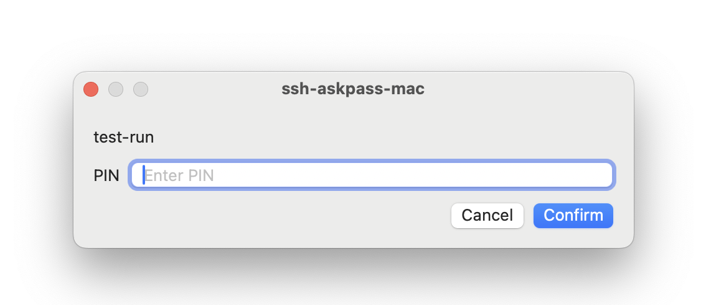
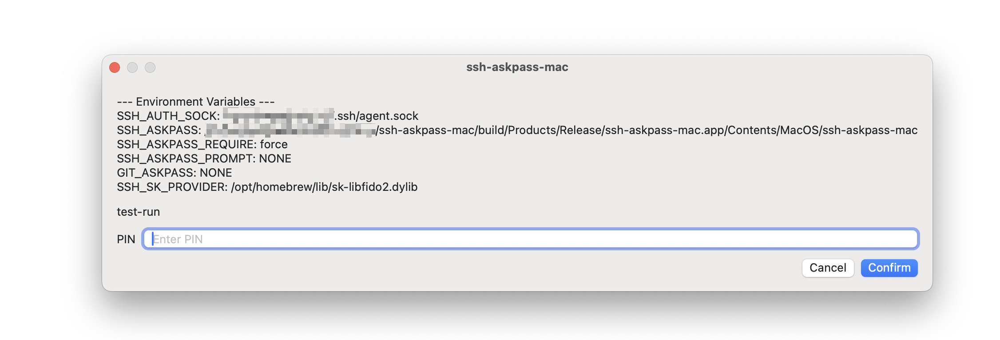

# ssh-askpass-mac

A simple **SSH Askpass** utility for macOS, implemented with SwiftUI.

This project provides a graphical password prompt for `ssh` and other tools that rely on the `SSH_ASKPASS` interface.

It was originally developed to solve the need for entering a YubiKey SSH (FIDO2) PIN code on macOS.

Currently developed and tested on **macOS Sequoia 15.4**.



## 🧰 Installation

### Prerequistites

- **Xcode** must be installed (the build process uses `xcodebuild`).

### Build

```zsh
make release
```

The compiled binary will be available in the `build/Build/Products` directory.

Or use `xcodebuild` to build: 

```zsh
xcodebuild
```

## 🚀 Usage

To use `ssh-askpass-mac`, set the `SSH_ASKPASS` environment variable to point to the built executable:

```zsh
export SSH_ASKPASS=/path/to/ssh-askpass-mac.app/Contents/MacOS/ssh-askpass-mac
```

You can then use it with SSH commands that require a passphrase. The graphical prompt will automatically appear when need.

## ⚙️ Additional Make Targets

The Makefile also provides several optional targets for debugging and testing:

```zsh
make debug      # Build a debug version (prints useful ENV values)
make run        # Run the release build
make run-debug  # Run the debug build
make clean      # Remove all build artifacts and build log.
```

Here is a screenshot of **debug** version:



## License

See the [LICENSE](LICENSE.md) file for license rights and limitations (MIT).